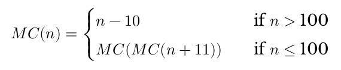

# Solutions to problems of chapter 8

## Recursion exercise

Write out the evaluation of the following. It might be a little less noisy if you do so wit the form that didn't use the composition operator `(.)`.

```hs
applyTimes :: (Eq a, Num a) =>
               a -> (b -> b) -> b -> b
applyTimes 0 f b =
    b
applyTimes n f b =
    f . applyTimes (n-1) f $ b
```

Solution:

```
applyTimes 5 (+1) 5

(+1) . applyTimes 4 (+1) $ 5
(+1) . (+1) . applyTimes 3 (+1) $ 5
(+1) . (+1) . (+1) . applyTimes 2 (+1) $ 5
(+1) . (+1) . (+1) . (+1) . applyTimes 1 (+1) $ 5
(+1) . (+1) . (+1) . (+1) . (+1) . applyTimes 0 (+1) $ 5
(+1) . (+1) . (+1) . (+1) . (+1) . applyTimes 0 (+1) 5 -- This is where the base case hits
(+1) . (+1) . (+1) . (+1) . (+1) . 5
(+1) . (+1) . (+1) . (+1) . 6
(+1) . (+1) . (+1) . 7
(+1) . (+1) . 8
(+1) . 9
10
```

# Chapter Exercises

## Review of Types

1. What is the type of `[[True, False], [True, True], [False, True]]?

- [ ] a. `Bool`
- [ ] b. mostly `True`
- [ ] c. `[a]`
- [x] d. [[Bool]]

2. Which of the following has the same type as `[[True, False], [True, True], [False, True]]`.

- [ ] a. `[(True, False), (True, True), (False, True)]`
- [x] b. `[3 == 3], [6 > 5], [3 < 4]]`
- [ ] c. `[3 == 3, 6 > 5, 3 < 4]`
- [ ] d. `["Bool", "more Bool", "Booly Bool!"]`

3. For the following function

```hs
func    :: [a] -> [a] -> [a]
func x y = x ++ y
```

which of the following is true?

- [x] a. `x` and `y` must be of the same type
- [x] b. `x` and `y` must both be lists
- [x] c. if `x` is a `String` then `y` must be a `String`
- [x] d. all of the above

4. For the `func` code above, which is valid application of `func` to both ot its arguments?

- [ ] a. `func "Hello World"`
- [x] b. `func "Hello" "World"`
- [ ] c. `func [1, 2, 3] "a, b, c"`
- [ ] d. `func ["Hello", "World"]`

## Reviewing currying

Given the following definitions, tell us what value results from further application.

```hs
cattyConny :: String -> String -> String
cattyConny x y = x ++ " mrow " ++ y

--fill in the types

flippy :: String -> String -> String
flippy = flip cattyConny

appedCatty :: String -> String
appedCatty = cattyConny "woops"

frappe :: String -> String
frappe = flippy "haha"
```

1. What is the value of `appedCatty "woohoo!"? Try to determine the answer for yourself, then test in the REPL.

```
appedCatty "woohoo!" ->
cattyConny "woops" "woohoo!" ->
woops" ++ " mrow " "woohoo!" ->
"woops mrow woohoo!"
```

2. What is the value of `frappe "1"`?

```
frappe "1" ->
flippy "haha" "1" ->
flip cattyConny "haha" "1" ->
cattyConny "1" "haha" ->
"1" ++ " mrow " ++ "haha"
"1 mrow haha"
```

3. What is the value of `frappe (appedCatty "2")`

```
frappe (appedCatty "2") ->
frappe (cattyConny "woops" "2") ->
frappe ("woops" ++ " mrow " ++ "2") ->
frappe "woops mrow 2" ->
flippy "haha" "woops mrow 2" ->
flip cattyConny "haha" "woops mrow 2" ->
cattyConny "woops mrow 2" "haha" ->
"woops mrow 2" ++ " mrow " ++ "haha" ->
"woops mrow 2 mrow haha"
```

4. What is the value of `appedCatty (frappe "blue")`?

```
appedCatty (frappe "blue") ->
appedCatty (flippy "haha" "blue") ->
appedCatty (flip cattyConny "haha" "blue) ->
appedCatty (cattyConny "blue" "haha") ->
appedCatty ("blue" ++ " mrow " ++ "haha") ->
appedCatty "blue mrow haha" ->
cattyConny "woops" "blue mrow haha" ->
"woops" ++ " mrow " ++ "blue mrow haha" ->
"woops mrow blue mrow haha"
```

5. What is the value of

```
cattyConny (frappe "pink")
           (cattyConny "green" (appedCatty "blue"))
```

```
cattyConny (frappe "pink")
           (cattyConny "green" (appedCatty "blue")) ->
cattyConny (flippy "haha" "pink")
           (cattyConny "green" (cattyConny "woops" "blue")) ->
cattyConny (flip cattyConny "haha" "pink")
           (cattyConny "green" ("woops" ++ " mrow " ++ "blue")) ->
cattyConny (cattyConny "pink" "haha")
           (cattyConny "green" ("woops mrow blue")) ->
cattyConny ("pink" ++ " mrow " ++ "haha")
           ("green" ++ " mrow " ++ "woops mrow blue") ->
cattyConny "pink mrow haha" "green mrow woops mrow blue" ->
"pink mrow haha" ++ " mrow " ++ "green mrow woops mrow blue" ->
"pink mrow haha mrow green mrow woops mrow blue"
```

6. What is the value of `cattyConny (flippy "Pugs" "are") "awesome"`?

```
cattyConny (flippy "Pugs" "are") "awesome" ->
cattyConny (flip cattyConny "Pugs" "are") "awesome" ->
cattyConny (cattyConny "are" "Pugs") "awesome" ->
cattyConny ("are" ++ " mrow " ++ "Pugs") "awesome" ->
cattyConny "are mrow Pugs" "awesome" ->
"are mrow Pugs" ++ " mrow " ++ "awesome" ->
"are mrow Pugs mrow awesome"
```

## Recursion

1. Write out the steps for reducing `divideBy 15 2` to its final answer according to the Haskell code.

```hs
type Numerator = Integer
type Denominator = Integer
type Quotient = Integer
type Remainder = Integer

divideBy :: Numerator -> Denominator -> (Quotient, Remainder)
divideBy n d = go n d 0
  where go n   d    c
         | n < d = (c, n)
         | otherwise =
           go (n-d) d (c+1)
```

```
divideBy 15 2

go 15 2 0
go (15-2) 2 (0+1)
go (13-2) 2 (1+1)
go (11-2) 2 (2+1)
go (9-2) 2 (3+1)
go (7-2) 2 (4+1)
go (5-2) 2 (5+1)
go (3-2) 2 (6+1)
-- we hit the base case since 1 < 2
(7, 1)
```

2. Write a function that recursively sums all numbers from 1 to `n`, `n` being the argument. So that if n was 5, you'd add `1+2+3+4+5` to get `15`. The type should be `(Eq a, Num a) => a -> a`.

```hs
-- recursive approach with pattern matching
sumToN :: (Eq a, Num a) => a -> a
sumToN 1 == 1
sumToN n = n + sumToN (n-1)

-- recursive approach using guard
sumToN :: (Eq a, Num a) => a -> a
sumToN n
  |    n == 1 = 1
  | otherwise = n + sumToN (n-1)

-- iterative
sumToN :: (Num a) => a -> a
sumToN n = foldl (+) 0 [1..n]

-- math formula
sumToN :: (Num a) => a -> a
sumToN = n * (n-1) `div` 2
```

3. Write a function that multiplies two integral numbers using recursive summation. The type should be `(Integral a) => a -> a -> a`

```hs
-- guard recursive
multiplyBySum :: (Integral a) => a -> a -> a
multiplyBySum x y = go x 0 y
  where go x res y
         | y == 0 = res
         | otherwise = go x (res+x) (y-1)

-- pattern matching
multiplyBySum :: (Integral a) => a -> a -> a
multiplyBySum x 0 = 0
multiplyBySum x y = x + multiplyBySum x (y-1)
```

## Fixing dividedBy

Our `divideBy` function wasn't quite ideal. For one thing, it was a partial function and doesn't return a result (bottom) when given a divisor that is `0` or less.

Using the pre-existing `div` function we can see how negative numbers should be handled.

```
Prelude> div 10 2
5
Prelude> div 10 (-2)
-5
Prelude> div (-10) (-2)
5
Prelude> div (-10) (2)
-5
```

The next issue is how to handle zero. Zero is undefined for division in math, so we ought to use a datatype that lets us say there was no sensible result when the user divides by zero. If you need inspiration, consider using the following datatype to handle this.

```hs
data DividedResult =
    Result Integer
  | DividedByZero
```

## McCarthy 91 function

We're going to describe a function in English, then in math notation, then show you what your function should return for some test inputs. Your taks is to write the function in Haskell.

The McCarthy 91 function yields `x-10` when `x > 100` and `91` otherwise. The function is recursive.


You haven't seen `map` yet, but all you need to know right now is that it applies a function to each member of a list and returns the resulting list. It'll be explained in more detail in the next chapter.

```hs
mc91 :: Integer -> Integer
mc91 n
  | n > 100   = n-10
  | otherwise = mc91 $ mc91 (n+11)
```

Using `map`, you can see how the result of an example input to `mc91` should look like.

```
Prelude> map mc91 [95..110]
[91,91,91,91,91,91,91,92,93,94,95,96,97,98,99,100]
```

## Numbers into words

```hs
module WordNumber where

import Data.List (intersperse)

digitToWord :: Int -> String
digitToWord n = undefined

digits :: Int [Int]
digits n = undefined

wordNumber :: Int -> String
wordNumber n = undefined
```

Here `undefined` is a placeholder to show you where you need to fill in the functions. The `n` to the right of the function names is the argument which will be an integer.

Fill in the implementations of the functions above so that `wordNumber` returns the English word version of the `Int` value.

You will first write a function that returns integers from 0-9 into their correcponding English words, "one", "two", and so on. Then you will write a function that takes the integer, separates the digits, and returns it as a list of integers. Finally you will need to apply the first function to the list produced by the second function and turn it into a single string with interspersed hyphens.

We've laid out multiple functions for you to consider as you tackle the problem. You may not need all of them, depending on how you solve it; These are suggestions. Play with them and look up their documentation to understand them in deeper detail.

You will probably find this difficult.

```
div           :: Integral a => a -> a -> a
mod           :: Integral a => a -> a -> a
map           :: (a -> b) -> [a] -> [b]
concat        :: [[a]] -> [a]
intersperse   :: a => [a] -> [a]
(++)          :: [a] -> [a] -> [a]
(:[])         :: a -> [a]
```

Here's what your output should look in the REPL when it's working:

```
Prelude> wordNumber 12324546
"one-two-three-two-four-five-four-six
```

```hs
module WordNumber where

import Data.List (intersperse)

digitToWord :: Int -> String
digitToWord 0 = "zero"
digitToWord 1 = "one"
digitToWord 2 = "two"
digitToWord 3 = "three"
digitToWord 4 = "four"
digitToWord 5 = "five"
digitToWord 6 = "six"
digitToWord 7 = "seven"
digitToWord 8 = "eight"
digitToWord 9 = "nine"
digitToWord _ = error "digitToWord: invalid digit."

digits :: Int -> [Int]
digits n
  | n < 10    = [n]
  | otherwise = digits (n `div` 10) ++ [n `mod` 10]

-- just for reference a tail recursive version of digits
digitsTailRec :: Integral a => a -> [a]
digitsTailRec n = go n []
  where go n l
         | n < 10    = n : l
         | otherwise = go (n `div` 10) (n `mod` 10 : l)


wordNumber :: Int -> String
wordNumber n = concat $ intersperse "-" $ map digitToWord $ digits n
-- equivalent to intercalate "-" $ map digitToWord $ digits nmodule WordNumber where
```

[Solution file](exercise.files/wordNumber.hs)
